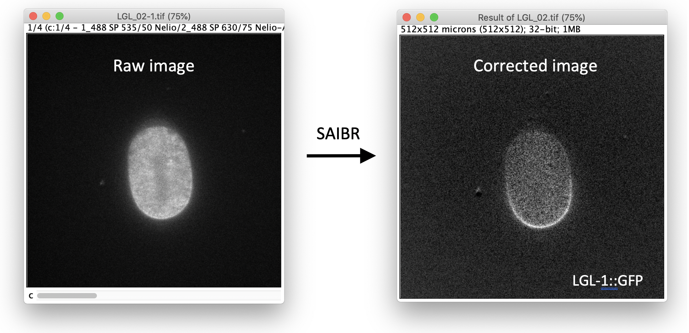

## SAIBR: Spectral Autofluorescence Image correction By Regression

[![CC BY 4.0][cc-by-shield]][cc-by]

This plugin provides an easy-to-use, GUI-based implementation of SAIBR (Spectral Autofluorescence Image correction By Regression): a simple, platform-independent protocol for spectral autofluorescence correction, especially useful for resolving and quantifying low-level green fluorophores in highly autofluorescent cells and tissues.

The method relies on a multi-channel imaging approach, which we describe in full in our paper (see [here](https://journals.biologists.com/dev/article/149/14/dev200545/276004/SAIBR-a-simple-platform-independent-method-for)). Please read the paper to familiarise yourself with the method before using this plugin.

## Instructions

Please see the [user guide](saibr_user_guide.pdf) for full instructions on installation and use. 

## Usage notes

***C. elegans***

- Embryos typically exhibit a weak autofluorescence signal in the vitelline envelope, which is distinct from the yolk-associated cytoplasmic signal we address in the paper. This signal is very photosensitive and can be eliminated by subjecting samples to a ~10 second pre-bleach step before capturing SAIBR images. While this pre-bleach step yields improved results, it is not essential in most cases because the vitelline envelope fluorescence is relatively weak.
- We have found anecdotally that mounting embryos on agarose can lead to enhanced and variable eggshell fluorescence. If only imaging GFP, this can be accounted for by using three channel SAIBR (as described in Figure 4G of the paper). Its effect will also be swamped out by strong RFP signal. However, we have found it is generally preferable to minimize eggshell signal by using alternative mounting procedures, such as bead mounts.
- In our experience, inter-channel correlations vary slightly as a function of imaging time, potentially due to uneven bleaching of AF sources. This variation tends to have only a minor effect on later time points. However, if desired, one can compensate for this effect by using matched calibration time series data and applying SAIBR to each time point independently.

***Fission yeast (S. pombe)***
- The use of narrow bandpass filters yielded substantially better results than longpass filters.

## Python implementation

A python implementation of the code is available [here](https://github.com/goehringlab/saibr_python)

## Citation

If you use this method as part of a publication, please cite the following reference: 

Nelio T. L. Rodrigues, Tom Bland, Joana Borrego-Pinto, KangBo Ng, Nisha Hirani, Ying Gu, Sherman Foo, Nathan W. Goehring; SAIBR: a simple, platform-independent method for spectral autofluorescence correction. Development 15 July 2022; 149 (14): dev200545. doi: https://doi.org/10.1242/dev.200545

## License

This work is licensed under a
[Creative Commons Attribution 4.0 International License][cc-by].

[![CC BY 4.0][cc-by-image]][cc-by]

[cc-by]: http://creativecommons.org/licenses/by/4.0/
[cc-by-image]: https://i.creativecommons.org/l/by/4.0/88x31.png
[cc-by-shield]: https://img.shields.io/badge/License-CC%20BY%204.0-lightgrey.svg
