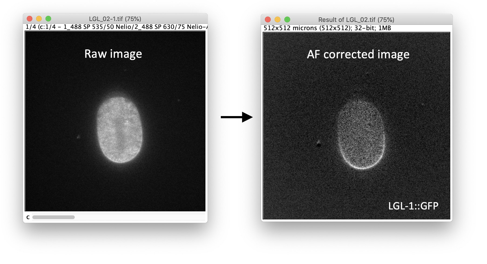

## SAIBR: Spectral Autofluorescence Image correction By Regression

[![CC BY 4.0][cc-by-shield]][cc-by]

A simple GUI-based FIJI plugin for performing spectral autofluorescence correction on fluorescence microscopy images.
A robust, platform-agnostic tool, especially useful for resolving and quantifying low-level green fluorophores in highly autofluorescent cells and tissues.

The method relies on a multi-channel imaging approach, which is described in the following paper: ???.
Please read the paper to familiarise yourself with the method before using this plugin.

## Instructions

Please see the [user guide](saibr_user_guide.pdf) for full instructions on installation and use. 

## Citation

If you use this program as part of a publication, please cite the following reference: ???

## License

This work is licensed under a
[Creative Commons Attribution 4.0 International License][cc-by].

[![CC BY 4.0][cc-by-image]][cc-by]

[cc-by]: http://creativecommons.org/licenses/by/4.0/
[cc-by-image]: https://i.creativecommons.org/l/by/4.0/88x31.png
[cc-by-shield]: https://img.shields.io/badge/License-CC%20BY%204.0-lightgrey.svg
